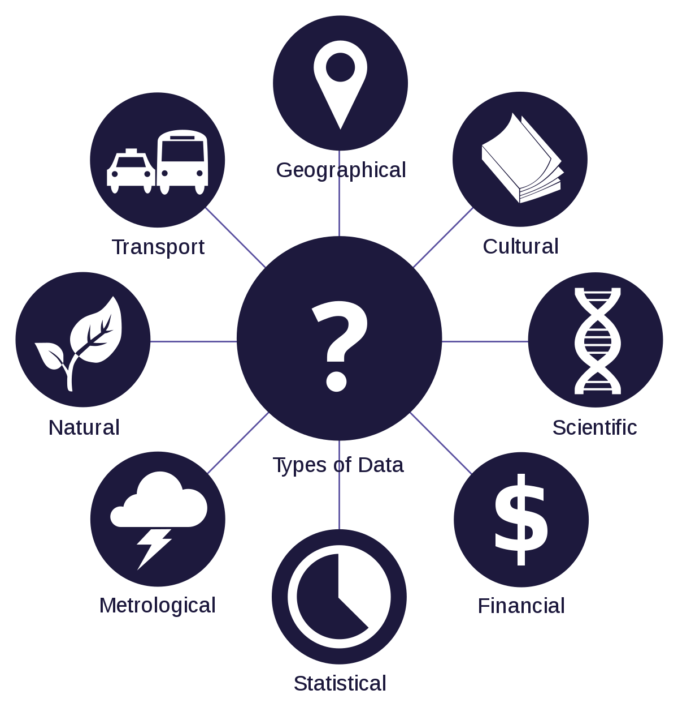

class: center, middle

# Data is the New Soil - Better Data Profiling with Python  
# ☜(⌒▽⌒)☞


---

# Who Am I ?

* work as Data Engineer
* Mozilla Representative
* Mozilla Tech Speaker
* ☕️ + ☕️ + 👩🏻‍💻 + 🛫  = ♥‿♥
* ♥ DATA ♥
* @manelbutterfly
---

# DATA ✌.ʕʘ‿ʘʔ.✌


1. What is Data?
  2. Columns
  3. Hard Numbers
  4. Structure
  5. Format
  6. Files
  7. Rows
  8. Extension
  9. Discipline
  10. Initiative
---

# DATA ~~life Cycle~~  


---

# How can we Define Data with good quality?


* __Accurate__:
  * Match data with reality
  * Draw correct conclusion from data
* __complete:__
  * No open question left,
  * Make a good decision based on available data
  * Closeness between need to know and what data tells you
* __Consistency:__
  * Trust data regardless of source
  * Identical information available to all processes
* __Timeliness:__
  * Availability without delay
  * Know what do you need when you need,
  * Smooth information flow: Data Delayed ==> Data Denied!

---

# What about today? ( ͡° ͜ʖ ͡°)


---

# A little context

Usual problems we face:

 - inconsistence sources, **NULL** values, missing records

 - schema design is not coherent

 - Any other concerns must have been fixed at the beginning,  before ETL


__We need to catch it right at the start before it becomes a problem__

> "Prevention is better than Cure"

---

# Data Profiling:


+ discovery of anomalies in the Data
+ understand: content, structure, relationship
+ Make decision: can be applied to other areas or purpose
+ understand: challenge will face in ETL

---
# When and How this happen:

* __HOW?__

  * writing query or use Data Profiling tools

* __WHEN?__

  * At the discovery phase

  * Before modeling the process of your Data

  * During ETL design

---
# Better Data Profiling with Python

### There is ~ 15 Python Libraries for Data

 


---

# Better Data Profiling with Python

### Pandas + Jupyter Notebook ✈️

* Why Pandas?

  * Designed to work with "labeled" and "relational" Data

  * Perfect Tool for Data Wrangling

  * Easy and quick data manipulation: aggregation, visualization

  * Two data structure: one dimensional and two dimensional

  * Easily delete and add column in a DF

  * Convert Data Structure to DataFrames objects

  * Represent Missing Data as NaNs {don't throw them away}

  * Powerful grouping by functionality

---

# Better Data Profiling with Python

###  🍺 + 🍻 = 👀

```Python
import pandas as pd
beers = pd.DataFrame.from_csv("https://raw.githubusercontent.com/nickhould/craft-beers-dataset/master/data/processed/beers.csv")
breweries = pd.DataFrame.from_csv("https://raw.githubusercontent.com/nickhould/craft-beers-dataset/master/data/processed/breweries.csv")

```

```Python
beers.head(5)
breweries.head(5)
```
* Data sets Columns

```Python
beers.columns
breweries.columns
```
```Python
Index(['abv', 'ibu', 'id', 'name', 'style', 'brewery_id', 'ounces'], dtype='object')
```
```Python
Index(['name', 'city', 'state', 'id'], dtype='object')
```
---
### Understand Data Columns:

+ Beers:

  + __ID:__ Unique identifier

  + __Name:__ Name of the beer

  + __ABV:__ Alcohol by volume of beer

  + __IBU:__ International Bittering Units of the beer.

  + __Style:__ Style of the beer

  + __Ounces:__ Ounces of the beer

+ Breweries:

  + __ID:__ Unique identifier of the brewery

  + __Name:__ Name of the brewery

  + __City:__ city where the brewery located

  + __State:__ State where brewery located
---
```Python
beers.dtypes

breweries.dtypes
```
```Python
abv           float64
ibu           float64
id              int64
name           object
style          object
brewery_id      int64
ounces        float64
dtype: object
```
```Python
name     object
city     object
state    object
id        int64
dtype: object
```
* ❗️ various numerical data cannot be grouped together into a single category
* ❗️ object type is not very helpful
---
### Easy and quick data manipulation (▰˘◡˘▰)

- Create a function to determine the category of each column

```Python
def get_var_category(series):
    unique_count = series.nunique(dropna=False)
    total_count = len(series)
    if pd.api.types.is_numeric_dtype(series):
        return 'Numerical'
    elif pd.api.types.is_datetime64_dtype(series):
        return 'Date'
    elif unique_count==total_count:
        return 'Text (Unique)'
    else:
        return 'Categorical'

def print_categories(df):
    for column_name in df.columns:
        print(column_name, ": ", get_var_category(df[column_name]))
```

---
```Python
print_categories(beers)
```
```Python
abv :  Numerical
ibu :  Numerical
id :  Numerical
name :  Categorical
style :  Categorical
brewery_id :  Numerical
ounces :  Numerical

```
```Python
print_categories(breweries)
```
```Python
name :  Categorical
city :  Categorical
state :  Categorical
id :  Numerical
```
---
## Let's dig to some description 🤞🏻

#### We want to see how many missing value for `ibu`: `International Bittering Units of the beer` it's numerical category

```Python
beers[beers['ibu'].isnull()]
```
#### OR
```Python
length = len(beers["ibu"])
print(length)
```
⬇️
```Python
2410
```
---
#### We wan to count the number of non-NA/non-null observations in a Series

```Python
count = beers["ibu"].count()
print(count)
```
⬇️
```Python
We have 1405 non-null observations
```
##### Print Missing values:
```Python
number_of_missing_values = length - count
pct_of_missing_values = float(number_of_missing_values / length)
pct_of_missing_values = "{0:.1f}%".format(pct_of_missing_values*100)
print(pct_of_missing_values)
```
⬇️
```Python
41.7%
```

---
## Let's make some aggregation

+ __Min/Max__
```Python
print("Minimum value: ", beers["ibu"].min())
print("Maximum value: ", beers["ibu"].max())
```
⬇️

```Python
Minimum value:  4.0
Maximum value:  138.0
```
+ __Mode__: The most frequent value in the dataset

```Python
print(beers["ibu"].mode())
```
⬇️

```Python
0    20.0
dtype: float64
```
---
+ __Mean__: sum of the values divided by the count of non-missing observations.

```Python
mean = beers["ibu"].mean()
```
```Python
42.7131672598
```
+ __Median__: The exact number in the middle of an ordered list contains numerical Values

```Python
median = beers["ibu"].median()
```
```Python
35.0
```
♣️ The mean and the median for `ibu` are in the same order of magnitude

+ __Distribution Plots__: use `seaborn` library with the `displotfunction`

```Python
import seaborn as sns
sns.set(color_codes=True)
sns.set_palette(sns.color_palette("muted"))
%matplotlib inline
import matplotlib.pyplot as plt

sns.distplot(beers["ibu"].dropna());
```
---
#### Distribution Plot result:

* The minimal value is close to 0 `IBU` and the maximum value is close to 140 `IBU`

* most frequent value is close to 20 `IBU`

* => We see we have two picks but we don't know why!


---
### Summarize non numerical variables:

* `describe` summarizes dataset: summarize adapted to a dataset with one specific  type

```Python
beers[["name", "style"]].describe()
```

---
### What Could I know about `Nonstop Hef Hop` from my data?

```Python
beers_and_breweries = pd.merge(beers,
                               breweries,
                               how='inner',
                               left_on="brewery_id",
                               right_on="id",
                               sort=True,
                               suffixes=('_beer', '_brewery'))
```
#### What is the style of `Nonstop Hef Hop`?
```Python
beers_and_breweries[beers_and_breweries['name_beer'] == 'Nonstop Hef Hop']['style'].value_counts()
```
⬇️

```python
American Pale Wheat Ale    12
Name: style, dtype: int64
```

#### From which State is `Nonstop Hef Hop`?
```Python
beers_and_breweries[beers_and_breweries['name_beer'] == 'Nonstop Hef Hop']['state'].value_counts()
```
⬇️

```python
OR    12
Name: state, dtype: int64
```
---
#### From which city is Nonstop Hef Hop?
```python
beers_and_breweries[beers_and_breweries['name_beer'] == 'Nonstop Hef Hop']['city'].value_counts()
```
⬇️

```python
Portland    12
Name: city, dtype: int64
```
#### Pandas profiling package

```Python
import pandas_profiling
prf = pandas_profiling.ProfileReport(beers_and_breweries)
pfr.to_file("profiling.html")
```

[Check me out 🤗](https://mermi.github.io/Python-meetup/profiling.html)
---

# Thank you

